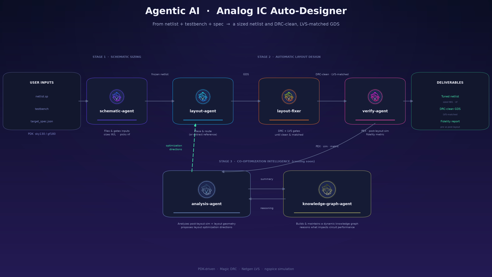

# Agentic AI Analog IC Auto-Designer

An **agentic AI pipeline** for analog integrated-circuit design automation.
Give it a **netlist**, a **testbench**, and a **target spec** — it drives a
team of cooperating AI agents to produce a **sized netlist** and a
**DRC-clean, LVS-matched GDS** that meets the spec, with a measured
pre- vs. post-layout fidelity report.

Built on [Claude Code](https://claude.com/claude-code) multi-agent
subagents and skills, and the open-source EDA toolchain
(Magic · Netgen · ngspice).

> **Status — 4 of 6 agents released.** The core pipeline
> (`schematic-agent`, `layout-agent`, `layout-fixer`, `verify-agent`) is
> available now. The co-optimization loop (`analysis-agent`,
> `knowledge-graph-agent`) is in development and coming soon.



---

## What it does

- **Inputs are three files, nothing more.**
  - `netlist` — the circuit topology (`.sp`)
  - `testbench` — the measurement setup
  - `target_spec.json` — the performance targets (gain, bandwidth, phase margin, …)
- **Upstream — schematic sizing.** `schematic-agent` files and validates the
  inputs, understands the circuit, and sizes device `W`/`L` and picks finger
  count `nf` until every spec key is met at minimum power. It hands off a
  **frozen netlist**.
- **Downstream — automatic layout design.** From that frozen netlist,
  `layout-agent` builds the layout (place + route, or extracts a reference
  GDS), `layout-fixer` drives it through the DRC and LVS gates, and
  `verify-agent` runs parasitic extraction and post-layout simulation.
- **Coming soon — co-optimization.** `analysis-agent` turns the post-layout
  numbers and layout geometry into concrete optimization directions, backed
  by a `knowledge-graph-agent` that reasons about which elements impact
  circuit performance. The loop feeds those directions back to
  `layout-agent` until the pre/post-layout gap closes.

The flow is **specialized for the PDKs listed in
`.claude/reference/pdk_options.json`** (currently **sky130A** active, with
gf180mcuD listed). The active PDK is a single project-wide setting — no
process facts are hardcoded anywhere.

---

## Features

- **Agentic, end-to-end** — from raw inputs to a verified GDS, with no
  hand-written sizing or layout steps.
- **Spec-driven sizing** — every `target_spec.json` key is tracked and met
  at minimum power.
- **Hard physical-verification gates** — DRC (Magic) and LVS (Netgen) must
  both pass before any post-layout result is reported.
- **Quantified fidelity** — a single `E` metric (DC gain, UGBW, phase margin
  drift) plus the full pre/post comparison table, computed in Python
  (`compute_fidelity.py`), never by inspection.
- **PDK-portable** — one `"selected"` key retargets the whole flow;
  process facts are read through `pdk_config.py`.

---

## Example

A worked example ships in the repo:

- **`example/test_miller_ota/`** — a two-stage Miller OTA (with nulling
  resistor `rz`). It holds the three inputs:
  - `two_stage_rz.sp` — the netlist
  - `two_stage_rz_pre.spice` — the pre-layout testbench
  - `target_spec.json` — the spec (PM 50–70°, UGBW ≥ 15 MHz, Gain ≥ 40 dB,
    Power ≤ 0.5813 mW)
- **`docs/miller_ota/`** — worked outputs:
  - `two_stage_miller_ota_circuit_graph.png` — the circuit graph
  - `two_stage_rz_pre_post_ac.png` — the pre/post-layout AC comparison

---

## Quick start

### Prerequisites

- **Claude Code** (the agents and skills are Claude Code subagent/skill
  definitions).
- **EDA toolchain** — Magic, Netgen, ngspice (see
  `.claude/reference/environment.md` for exact paths and known quirks).
- **A PDK** — sky130A is the validated default; gf180mcuD is listed but
  unverified (see `.claude/reference/pdk_options.json`).

### Run a design

1. Place your three files — netlist, testbench, `target_spec.json` — where
   `design-sheets-intake` can collect them.
2. Run the flow from the project root (spawned as Claude Code subagents):

   ```
   schematic-agent → layout-agent → layout-fixer → verify-agent
   ```

3. Read `CLAUDE.md` first — it is the entry point and the source of the
   loop's ground rules (netlist freeze, DRC/LVS gates, budgets, artifact
   layout). Each role's procedure is its `.claude/agents/<role>.md` file.

### Example run

A concrete prompt, once you've launched Claude Code in this repo:

> run this project with `example/test_miller_ota`, when calling
> `schematic-sizing` the iteration is set as 20, when calling
> `layout-fixer` the iteration is limited to 50

The agents size the netlist, build and verify the layout, and write their
per-iteration artifacts under `runs/<design>/` — e.g. `runs/test_miller_ota/`.

---

## Python dependencies

Found by scanning the scripts (`import` / `from` across the repo):

| Package | Used for |
|---|---|
| `glayout` | analog layout generation engine (place & route) |
| `gdsfactory` | underlying PDK-aware layout library |
| `klayout` (`pya`) | KLayout Python API — GDS viewing / PNG snapshots |
| `gdstk` | GDS read/write |
| `numpy`, `matplotlib`, `PyYAML` | numerics, plotting, config |

## Installation

A simplified illustration (exact paths, versions and tool quirks are in
`.claude/reference/environment.md`):

```bash
# 0) PDK — install sky130A via open_pdks, then point pdk_options.json at it
#    (default pdk_root: ~/pdk/manual). The PDK is NOT vendored in this repo.

# 1) EDA tools
brew install magic netgen ngspice            # macOS (Homebrew)
#  or via conda:
conda install -c conda-forge magic netgen ngspice

# 2) KLayout (optional, for viewing GDS) + its Python API
pip install klayout

# 3) Python packages
pip install numpy matplotlib pyyaml gdstk gdsfactory glayout
```

> `glayout` is the analog-layout engine — imported as `glayout`, with PDK
> modules named by `pdk_options.json`'s `glayout_module` (e.g.
> `glayout.sky130`). Install it editable from its source if it is not on
> PyPI for your platform. `klayout` is the Python binding to the KLayout
> app; install the app itself too if you want the GUI viewer.

---

## Roadmap

- [x] Schematic sizing (`schematic-agent`)
- [x] Automatic layout design (`layout-agent`, `layout-fixer`, `verify-agent`)
- [ ] Co-optimization loop (`analysis-agent`)
- [ ] Dynamic knowledge graph (`knowledge-graph-agent`)

---

## License

[MIT](LICENSE) © 2026 Cherry Sun
